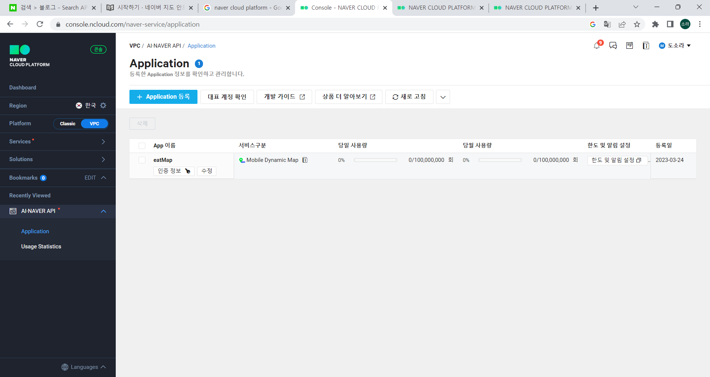
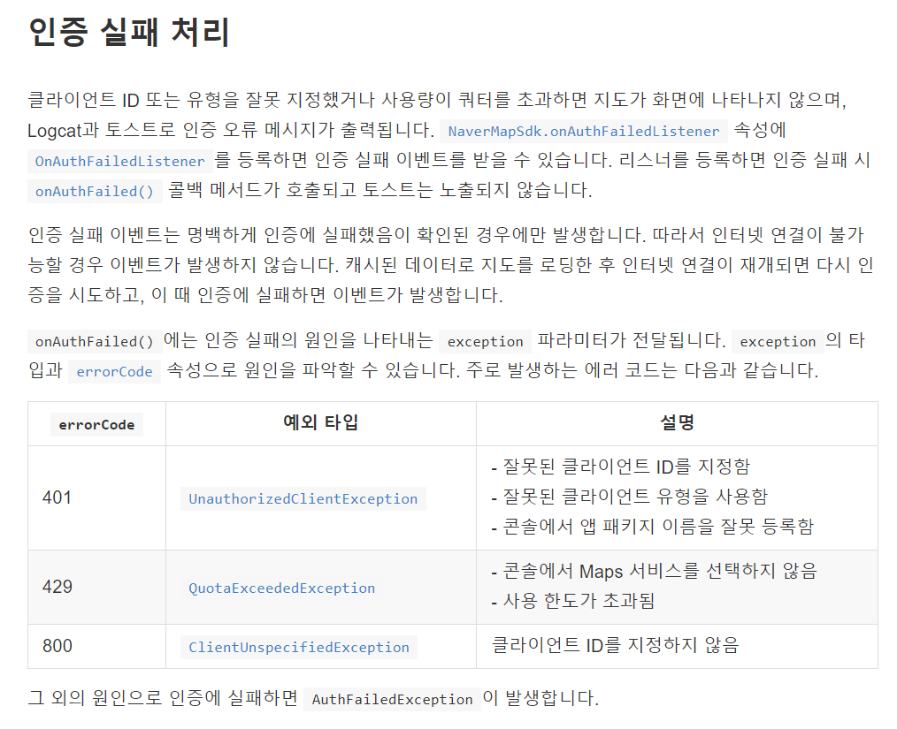
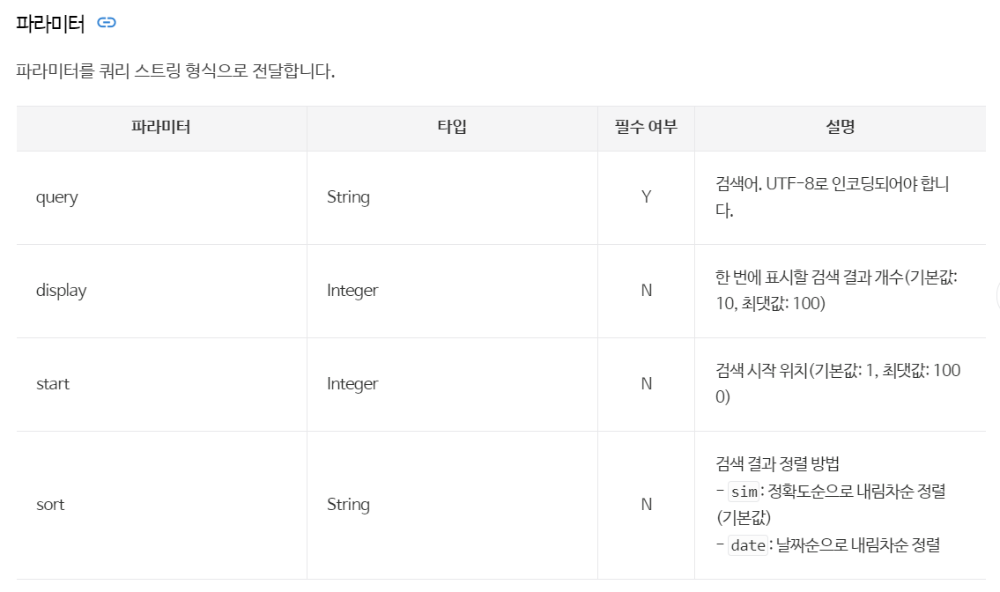
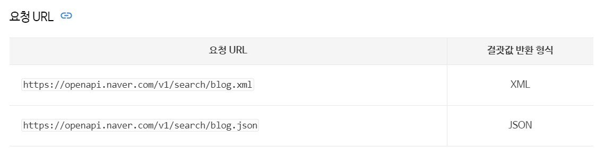
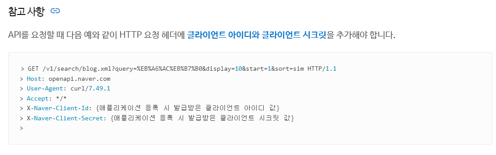
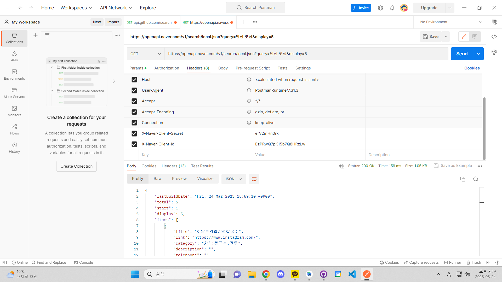
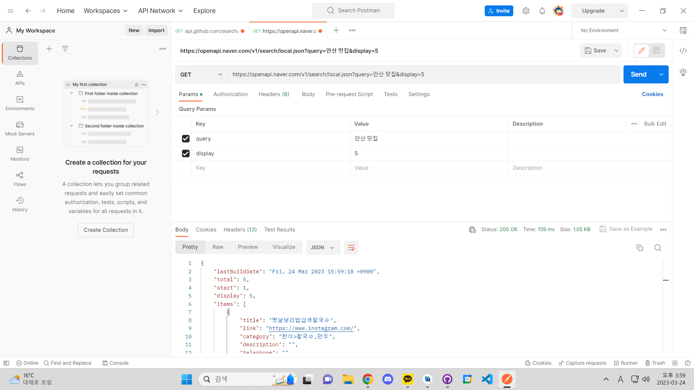

# NaverMapApp
 네이버 오픈 API를 이용한 지도앱

## 키워드
- 비로그인 방식 오픈 API : (https://developers.naver.com/docs/common/openapiguide/)
- CoordinatorLayout
- 네이버 ncloud 콘솔에 앱 등록
- 
- 지도 마커
- meta-data
  * 상위 구성요소에 제공될 수 있는 추가 임의 데이터 항목의 이름-값 쌍
- 발생할 수 있는 에러

- Camera Easing : 부드럽게 가감속하며 이동, 가까운 거리를
- 이동할 때 적합
- 네이버 검색 API (링크 : https://developers.naver.com/docs/serviceapi/search/blog/blog.md)
  * 파라미터
  
  * 요청 url
  
  * 응답
  
  * 포스트맨
    - headers
        
    - params
        
  

